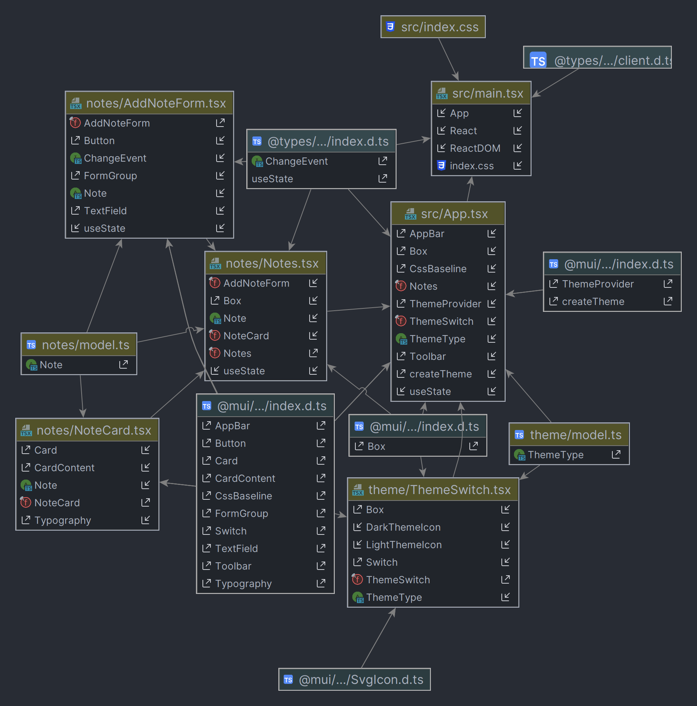

1. Declaration of the dependencies for the Material UI?
   - Im file package.json und yarn.lock  

2. In which component is the overall layout coming together (toolbar, main panel)?
   - Im file app.tsx
   

3. How does the theming support work?
   Where is the current theme state stored?
   Which component is rendering the theme toggle button?
   How is the current theme state updated when the switch is toggled?
   - Im file model.ts wurden die mögliche Zustände gespeichert und im File ThemeSwitch.tsx umgesetzt
   - Der <Switch/> Komponent rendert den toggle Button
   - Mit der Methode setThemeType, welche im File App.tsx definiert wurde

4. Which components are dealing with the actual lab notes? Maybe draw a small diagram (nothing fancy, just a hand-drawn sketch) which illustrates their composition and interaction. Visualize parent/child relationships, state storage, and the flow of props.
   - 